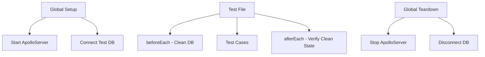

# Test Standardization Plan

## Objective
Standardize all backend tests to use a consistent ApolloServer-based approach with:
- Single global server instance
- Database cleanup between tests
- Reusable test utilities

## Architecture



## Implementation Steps

1. Create global test files:
   - `backend/__tests__/globalSetup.ts` - Server initialization
   - `backend/__tests__/globalTeardown.ts` - Clean shutdown
   - `backend/__tests__/testUtils.ts` - Reusable utilities

2. Update Jest config (`backend/jest.config.js`) to:
   ```javascript
   module.exports = {
     globalSetup: './__tests__/globalSetup.ts',
     globalTeardown: './__tests__/globalTeardown.ts',
     setupFilesAfterEnv: ['./__tests__/testUtils.ts']
   }
   ```

3. Standard test template:
   ```typescript
   import { testServer, cleanDB } from './testUtils';
   
   describe('Feature Tests', () => {
     beforeEach(async () => {
       await cleanDB(); // Clear all test data
     });
     
     it('should test feature', async () => {
       const res = await testServer.executeOperation({
         query: `...`,
         variables: {...}
       });
       expect(res.errors).toBeUndefined();
       expect(res.data?.feature).toEqual(...);
     });
   });
   ```

## Key Utilities

1. `cleanDB()` - Truncates all tables while maintaining schema
2. `createTestData()` - Factory for common test entities
3. `testServer` - Preconfigured ApolloServer instance
4. `testContext` - Standard test context with:
   - Authenticated test user
   - Test database connection
   - Mock services when needed

## Database Cleanup Approach

1. Before each test:
   - Use Prisma's `$transaction` to:
   ```typescript
   await prisma.$transaction([
     prisma.user.deleteMany(),
     prisma.gym.deleteMany(),
     // ...all other models
   ]);
   ```
2. After each test:
   - Verify no test data remains
   - Reset any mocks

## Migration Plan

1. Phase 1: Create infrastructure files
2. Phase 2: Convert integration tests
3. Phase 3: Convert unit tests
4. Phase 4: Remove old test utilities

## Benefits

- Consistent test patterns
- Faster execution (shared server)
- Reliable isolation
- Easier maintenance